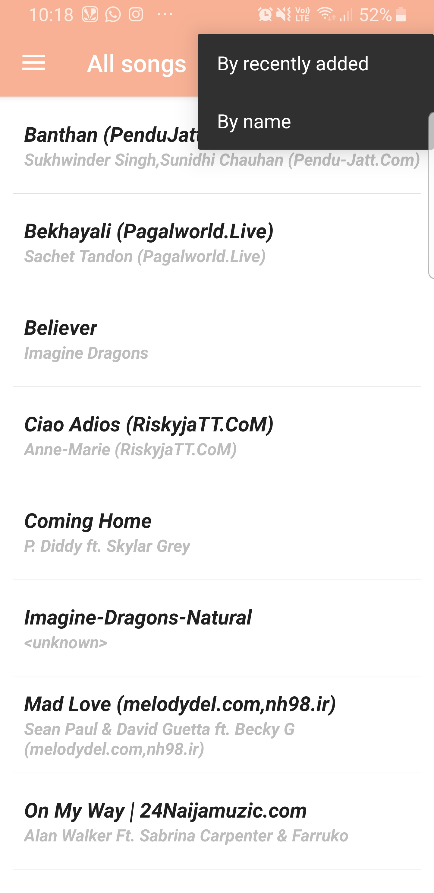
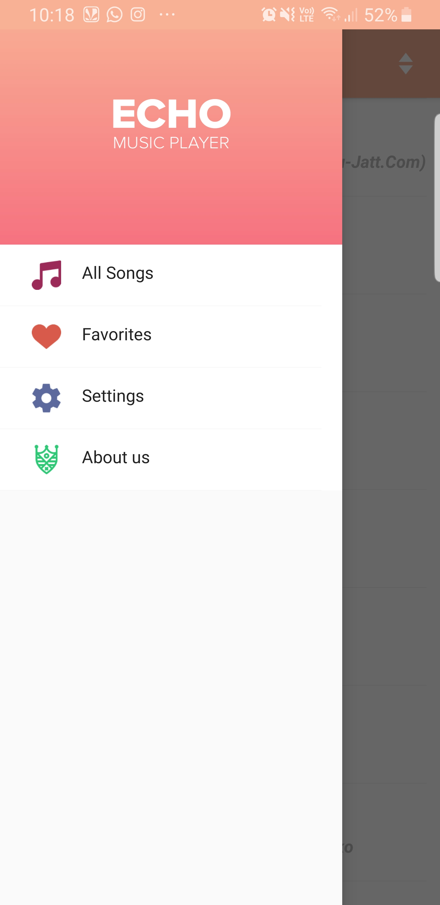
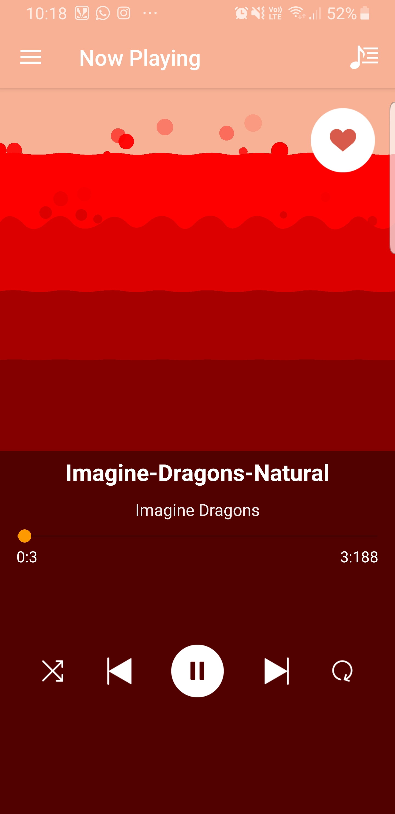
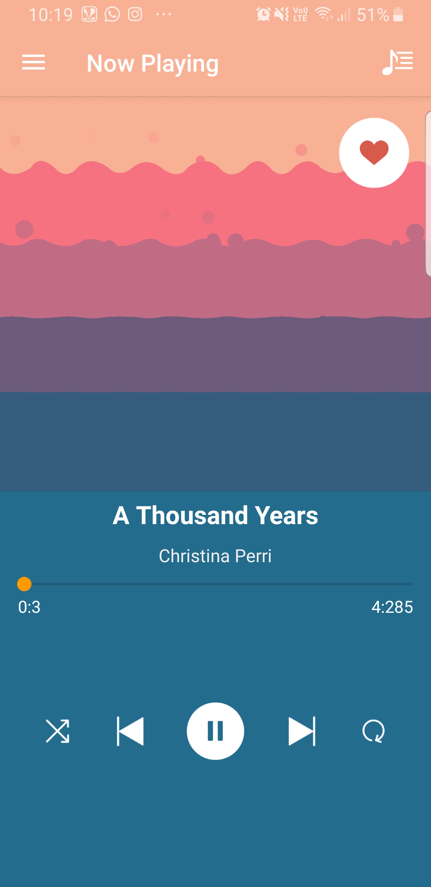
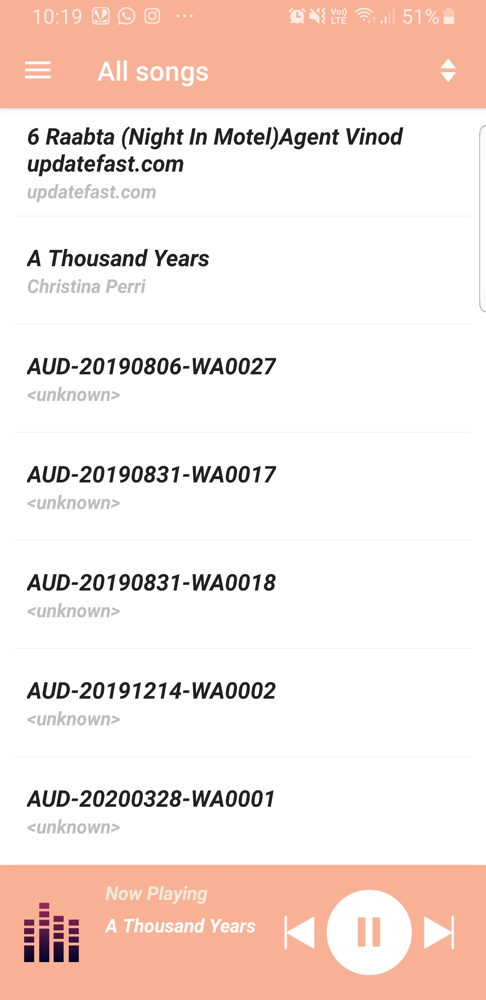

# Echo-Music-Player
Created a music player application using <b>KOTLIN</b> containing songs stored on the <b>external storage and saving it in a sqlLite database</b>.Used <b>Shared preferences</b> for filtering the songs by recently added and by name using a <b>navigation drawer</b> to switch between different fragments.Implemented the <b>media player</b> library and understood the lifecycle of it as well as learned about the android lifecycle.Used <b>Broadcast Receiver</b>.Also added a <b>shake to change song</b> feature,creating a user friendly application for end users.Also learned to use <b>customizable adapters</b>,also used <b>parcelable</b> to serialize a class so that its properties can be moved from one class to another
## Snapshots
### SplashScreen

### MainScreen

Main screen with filters

### NavigatonDrawer

### Songplaying
      

#### 1st screen is of favorites and second is of normal Activity

### MainscreenduringSong

